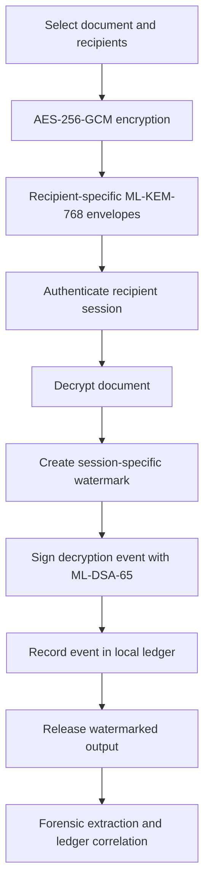

# SIH-26237 — Cryptographic Attribution & Decryption Provenance

> A Smart India Hackathon project exploring how to make document access more accountable: encrypt a document for multiple recipients, create a recipient/session-specific watermark when it is decrypted, and record signed events in a tamper-evident local ledger.

**Status:** Engineering prototype · **Problem statement:** SIH 26237 · **Maintainer:** [Manoj Pawar](https://github.com/manoj-9899)

[Walkthrough](DEMO_GUIDE.md) · [Detailed technical reference](TECHNICAL_REFERENCE.md) · [Source code](src/)

---

## The problem

When a document is encrypted for several authorized people, the recipients may all decrypt the same original content. If one copy later leaks, it can be difficult to tell which access session it came from.

This project explores a possible accountability workflow: associate each successful decryption with a unique watermark and signed audit event, then use those records during an investigation.

It is **not** a certified secure-document product, and an attribution result should be treated as technical evidence to review—not as automatic or legally conclusive proof of intent.

## How it works

1. **Package:** The sender selects a document and recipients. The document is encrypted with AES-256-GCM, and a separate ML-KEM-768 encapsulation is created for each recipient's key.
2. **Authorize:** The recipient must have an active local session and a matching recipient envelope before decryption proceeds.
3. **Decrypt and watermark:** The app recovers the content-encryption key, decrypts the document, and creates a watermark payload tied to the recipient and decryption session.
4. **Sign and record:** A decryption event is signed with ML-DSA-65 and submitted to the local ledger before the app releases the watermarked output.
5. **Investigate:** An operator submits a suspected leaked artifact to the forensic workflow. The app attempts to extract the watermark and correlate it with provenance records.
6. **Audit:** The ledger explorer provides chain-integrity checks and simulated tampering scenarios.



## Main modules

| Module | Purpose |
| --- | --- |
| **Mission Demo** | Guided overview of the end-to-end workflow |
| **Sender Studio** | Prepare a document package and select recipients |
| **Recipient Portal** | Authenticate a local identity and run the decryption workflow |
| **Forensic Studio** | Inspect a leaked artifact, extract a watermark, and review matching provenance |
| **DLT Explorer** | Inspect local ledger records and run integrity/tamper demonstrations |
| **PQC Registry** | Inspect enrolled demo identities and public-key metadata |
| **Attack Lab** | Run selected negative-path and tamper scenarios |

## Technology

- **UI:** React 19, TypeScript, Vite
- **Styling:** Tailwind CSS 4
- **Post-quantum cryptography:** `@noble/post-quantum`, using ML-KEM-768 and ML-DSA-65
- **Symmetric encryption and hashing:** Web Crypto API, AES-256-GCM, SHA-256
- **Watermarking / PDF utilities:** project-specific text and PDF processing code
- **Local persistence:** IndexedDB
- **Tests:** Node test runner with `tsx`

The cryptographic algorithms are provided by libraries and browser APIs; this repository is an application prototype built around them, not a new cryptographic algorithm.

## Run locally

### Prerequisites

- Node.js 22 or later
- npm
- A modern browser with Web Crypto API and IndexedDB support

### 1. Clone and install

```bash
git clone https://github.com/manoj-9899/sih-26237.git
cd sih-26237
npm ci
```

### 2. Start the development server

```bash
npm run dev
```

Open [http://localhost:3000](http://localhost:3000).

### 3. Optional environment configuration

The repository includes `.env.example` for optional application/AI configuration. Only configure values that the feature you are testing actually requires. Never commit real API keys or secrets; keep your local `.env` file untracked.

### 4. Run checks

```bash
npm test
npm run lint
npm run build
```

To preview the production build:

```bash
npm run preview
```

## Beginner demo

For the guided click-by-click instructions and explanations of each screen, use **[DEMO_GUIDE.md](DEMO_GUIDE.md)**.

Suggested first run:

1. Open **Mission Demo** and understand the overall sequence.
2. In **Sender Studio**, choose a sample document and at least one recipient, then create a package.
3. Open **Recipient Portal** and authenticate as an authorized sample identity.
4. Decrypt the package and inspect the resulting watermarked output and recorded event.
5. Use **Forensic Studio** to test extraction from the demo artifact.
6. Open **DLT Explorer** and **Attack Lab** to examine the integrity checks and negative-path demonstrations.

Use sample data only. Browser-local state can be reset, and a fresh browser profile may not contain the same records.

## Repository layout

```text
.
├── src/
│   ├── components/        # Workstation screens and shared UI
│   ├── crypto/            # Cryptographic and session helpers
│   ├── ledger/            # Local ledger and integrity logic
│   ├── services/          # Distribution/decryption orchestration
│   ├── storage/           # IndexedDB persistence
│   ├── types/             # Domain types
│   └── watermark/         # Watermark embedding/extraction utilities
├── tests/                 # Cryptography, session, ledger, and watermark tests
├── DEMO_GUIDE.md          # Detailed walkthrough for first-time users
├── TECHNICAL_REFERENCE.md # Preserved long-form technical documentation
├── package.json
└── vite.config.ts
```

## Security model and limitations

This is a **demonstration and learning project**. Important limitations:

- The ledger and its validator/quorum behavior are simulated locally; this is not a distributed deployment with independent, separately administered validators.
- Browser storage is not a hardware security module. A compromised device, unlocked session, malicious extension, or modified client can undermine assumptions.
- Invisible watermarking is not guaranteed to survive every transformation. Text normalization, copying between applications, format conversion, printing, OCR, or editing may remove or damage its carrier.
- A digital signature can verify that a particular key signed the recorded payload; by itself it cannot prove a person's intent or that their key/device was never compromised.
- Watermark extraction and ledger correlation provide evidence for investigation, not an infallible identity verdict or a substitute for a legal process.
- The project has not been independently security-audited or certified for handling classified, regulated, or otherwise sensitive real-world documents.
- The repository includes optional AI configuration. Do not assume every feature is offline or air-gapped without reviewing its code path and observing network activity in the environment you run.

**Do not use this prototype to protect real classified information, production secrets, or sensitive customer documents.** Use synthetic/sample data while learning and testing.

## What to explore next

- Read `src/services/distributionService.ts` to understand how the workflow is coordinated.
- Trace the ML-KEM encapsulation/decapsulation path in `src/crypto/`.
- Study how a watermark payload is serialized and extracted in `src/watermark/`.
- Follow how signed decryption events are committed and verified in `src/ledger/`.
- Run `npm test`, then inspect what each test proves—and what it does not prove.

## Author

**Manoj Pawar** · [GitHub](https://github.com/manoj-9899) · [Portfolio](https://manoj-9899.github.io/manojpawar/)

---

*Built for learning and prototyping around cryptographic attribution and immutable decryption provenance.*
